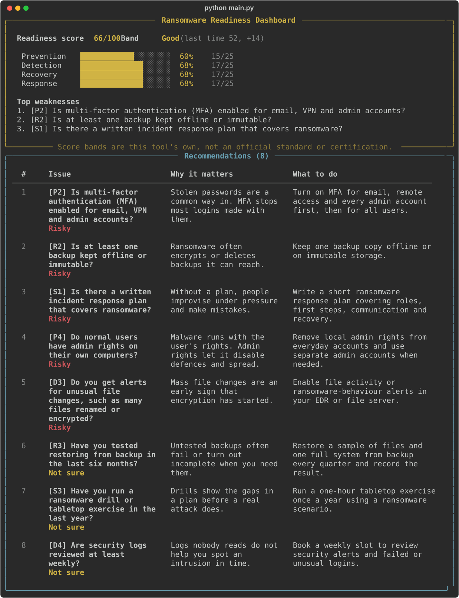

# Ransomware Readiness CLI

A terminal app that asks 20 yes / no / not sure questions about an organisation's ransomware defences, scores the answers out of 100, and prints a readiness dashboard with a fix for every weak answer.

Built for problem statement #343, "Develop Ransomware Readiness Assessment tool" (Terminal Application slot).



## Who it is for

IT admins and team leads at small organisations, schools and colleges who want a quick view of their ransomware exposure without a full audit. A run takes about 5 minutes and needs no setup beyond Python.

## Install and run

Requires Python 3.9 or newer.

```bash
git clone https://github.com/bitflicker64/ransomware-readiness.git
cd ransomware-readiness
python3 -m venv .venv && source .venv/bin/activate
pip install -r requirements.txt
python main.py
```

Use the arrow keys and Enter to answer. Press Ctrl+C at any point to quit without writing a report.

## What you get

- A score out of 100 and a colour-coded band.
- A percentage bar for each of the 4 categories: Prevention, Detection, Recovery and Response.
- The top 3 weaknesses, ordered by how much each one matters.
- For every risky or "not sure" answer, why it matters and what to do.
- `report.txt` with the same dashboard and recommendations in plain text.
- `history.json` with past scores, so the dashboard shows the change since the last run.

## Scoring

Each category has 5 questions and each question is worth 5 points, so every category is worth 25 and the maximum is 100.

| Answer | Points |
| --- | --- |
| Safe answer | 5 |
| Not sure | 2 |
| Risky answer | 0 |

Every question in `questions.json` has a `safe_answer` of `yes` or `no`. For P4, "Do normal users have admin rights?", the safe answer is `no`.

Category percentage is category points / 25 x 100. The 4 category percentages average to the total score.

| Score | Band |
| --- | --- |
| 80 to 100 | Strong (green) |
| 60 to 79 | Good (yellow) |
| 40 to 59 | Basic (orange) |
| 0 to 39 | Poor (red) |

Top weaknesses are the risky answers sorted by the `weight` field (3 is highest). If there are fewer than 3 risky answers, "not sure" answers fill the remaining slots.

The score bands are this tool's own, not an official standard, and the result is not a certification.

## Editing the questions

Questions live in `questions.json`:

```json
{
  "id": "R2",
  "category": "Recovery",
  "text": "Is at least one backup kept offline or immutable?",
  "safe_answer": "yes",
  "weight": 3,
  "why": "Ransomware often encrypts or deletes backups it can reach.",
  "fix": "Keep one backup copy offline or on immutable storage."
}
```

The app checks the file on start and refuses to run if a field is missing, a category is unknown, an id repeats, or a category does not have exactly 5 questions.

## Project layout

```
ransomware-readiness/
├── main.py             entry point, menu, flow
├── questions.json      20 questions with safe_answer, weight, why, fix
├── quiz.py             asks questions, collects answers
├── scoring.py          points, category %, band, weaknesses
├── dashboard.py        rich dashboard and recommendations
├── report.py           writes report.txt
├── history.py          keeps past scores in history.json
├── scripts/screenshot.py  regenerates docs/dashboard.svg
└── tests/              unit tests for scoring and the report
```

## Tests

```bash
python -m unittest discover -s tests -v
```

The tests check that all safe answers score 100, all risky answers score 0, the reverse question scores correctly, category percentages add up to the total, every weak answer has a recommendation, and `report.txt` matches the dashboard.

## Out of scope

The app does not scan systems, networks or files, has no accounts or web UI, and uses no live threat data.
